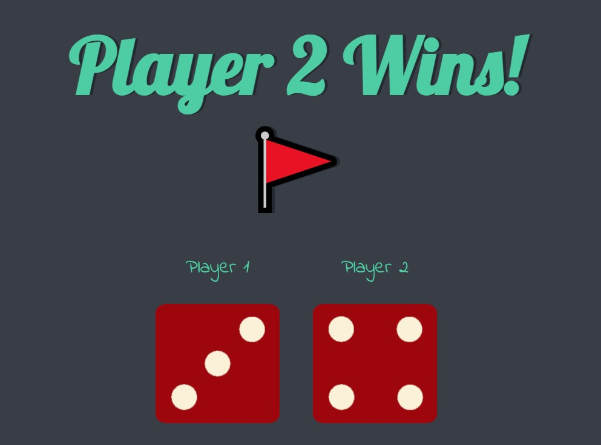

<!-- PROJECT -->
<a id="readme-top"></a>
<div align="center">
  

  <h3 align="center">DICEE Challenge</h3>

  <p align="center">
    A simple game to start learning JavaScript!
  </p>
</div>


<!-- TABLE OF CONTENTS -->
<details>
  <summary>Table of Contents</summary>
  <ol>
    <li>
      <a href="#about-the-project">About The Project</a>
      <ul>
        <li><a href="#built-with">Built With</a></li>
        <li><a href="#key-feature">Key Feature</a></li>
      </ul>
    </li>
    <li>
      <a href="#getting-started">Getting Started</a>
    </li>
    <li><a href="#contact">Contacts</a></li>
  </ol>
</details>


<!-- ABOUT THE PROJECT -->
## About The Project

The Dicee Challenge is a two-player game where each player rolls a pair of dice. The player with the higher total score wins the game. If both players have the same score, it's a draw. May the best roll win!


### Built With

<div display="flex">
  
	
	
 	
</div>


### Key Feature

Step 1. Generate a random number between 1 and 6 using `Math.floor(Math.random() * 6) + 1` and store it in the `randomNumber1` variable.

Step 2. Create a string variable `randomImg1` by concatenating "images/dice", `randomNumber1`, and ".png".

Step 3. Use `document.querySelector("img.img1").setAttribute("src", randomImg1)` to set the source attribute of the first dice image to the generated random image.

Step 4. Generate a random number between 1 and 6 using `Math.floor(Math.random() * 6) + 1` and store it in the `randomNumber2` variable.

Step 5. Create a string variable `randomImg2` by concatenating "images/dice", `randomNumber2`, and ".png".

Step 6. Use `document.querySelector("img.img2").setAttribute("src", randomImg2)` to set the source attribute of the second dice image to the generated random image.

Step 7. Compare `randomNumber1` and `randomNumber2`.
- If `randomNumber1` is greater, update the text content of the heading to "🚩 Player 1 Wins!".
- If `randomNumber2` is greater, update the text content of the heading to "Player 2 Wins! 🚩".
- If both `randomNumber1` and `randomNumber2` are equal, update the text content of the heading to "Draw!".

<p align="right">(<a href="#readme-top">back to top</a>)</p>


<!-- GETTING STARTED -->
## Getting Started

To get a local copy up and running follow these simple example steps.

1. Clone the repo
   ```sh
   git clone https://github.com/majinbrum/dicee-challenge.git
   ```
2. Open the `index.html` file and play the demo! You just need to refresh the page to play :)

<p align="right">(<a href="#readme-top">back to top</a>)</p>


<!-- CONTACTS -->
## Contacts

Bruna Alamia - [@linkedin](https://linkedin.com/in/brunaalamia) - brunaalamia@gmail.com

<p align="right">(<a href="#readme-top">back to top</a>)</p>


